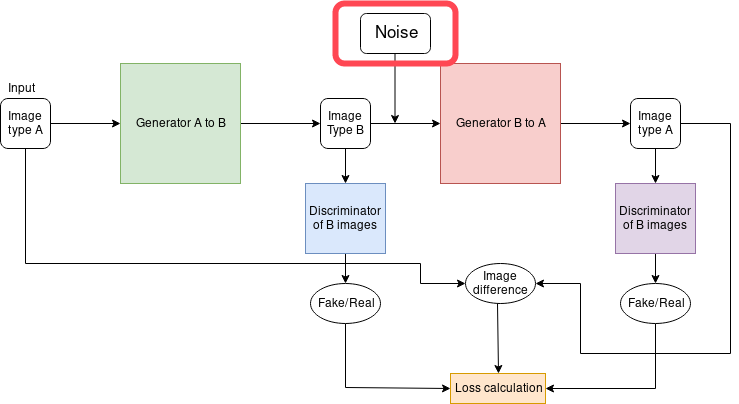
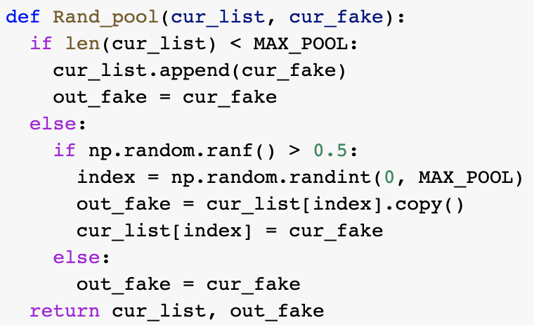
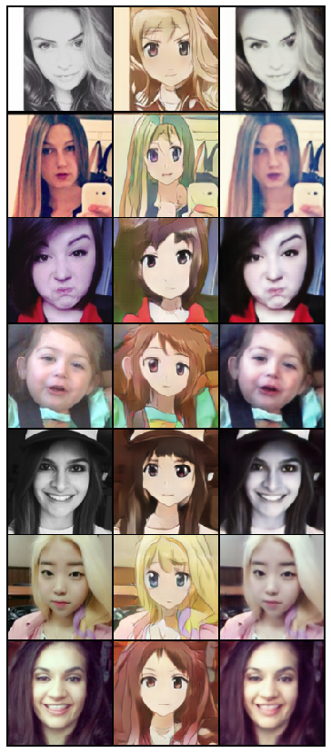
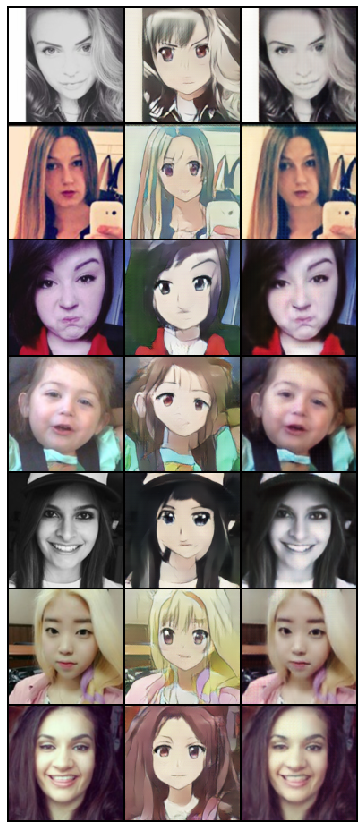
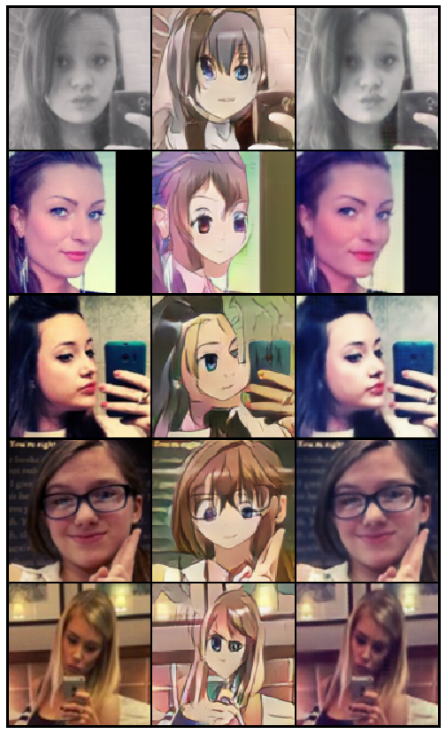
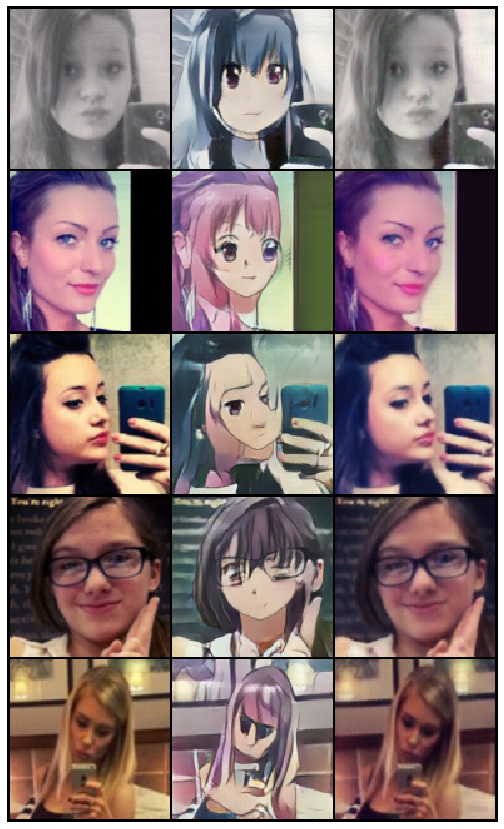
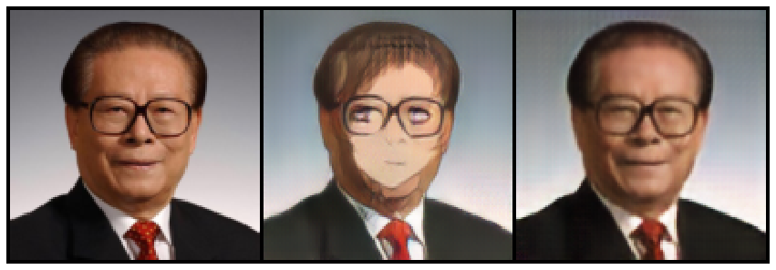
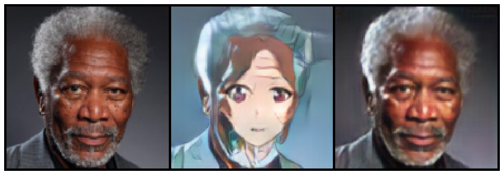
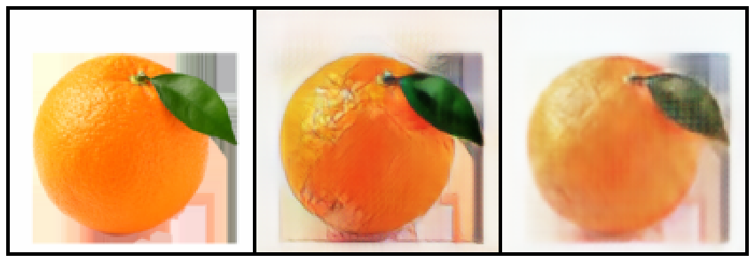

Face2Anime-CycleGAN
================

Motivations
-----------
The popularity of FaceApp, an app that use a Generative Model to change gender and age of a person in an image, sparked my interest in the transformative property of generative model in computer vision. I will be looking to transform people faces into anime faces. I will try to achieve a good result in unpaired image-to-image style transfer by experimenting with Cycle-Consistent Adversarial Networks or CycleGAN.

Methodology
-----------

### What is GAN ? ###
Generative Adversarial Networks (GANs) are an approach to generative modeling using deep learning methods. Generative modeling are subset of unsupervised learning, a type of Machine Learning algorithm, that involves self learning patterns in input data in order to generate new examples that could have been from the traing dataset. Out of all training methods for a generative model, GAN seemed to me to be the most creative and clever way. It turned the unsupervised learning problem into a supervised learning problem by introducing two sub-models, a generator and a discriminator. The generator network and discriminator network are jointly trained against each other in a zero-sum game. While the generator tries to produce samples from the domain of the desired distribution, the discriminator is actively trying to classify whether a sample is from the actual distribution (real) or is generated by the generator (fake). Eventually, the generator will learns to aproximate the underlying distribution and left the discriminator guessing randomly. 

### CycleGAN Model Architecture ###
In an unpaired image problem, we do not have the luxury of having a predefined relationship that we can learn from like in paired image problem. We need to make sure that there is a meaningful relation between the input domain and the output domain. CycleGAN was created to with this in mine. In CycleGAN, the generator will map input image  (input type A)  from domain  DA  to some image in target domain DB , but to make sure that there is meaningful relation between these images, they must share some features that can be used to map this output image back to input image. So there must be another generator whose job is to map back this output image back to original input to produce a meanignful mapping between the input and the generated output [3]. 

In a nutshells, the model takes an input from a domain DA, we call this InputA, and fed it into the first generator GeneratorA→B whose job is to turn the input image from domain DA to an image in a target domain DB, we call this generated image GenB. GenB is then fed into the second generator GeneratorB→A whose job is to convert GenB from domain DB back into the original domain DA, we call this ReconstructA. This is similar to autoencoders, but the latent space is Dt. In theory, ReconstructA must be closely resemblance InputA, this condition defined a meaningful mapping that is absent in unpaired dataset [3].

To put this in plain English, the goal is to achieve balance between preserving original content and re-creating “styles” in the reference images onto the input images [2]. Similar to GAN, the generator learns to produce samples from the desired distribution and the discriminator tries to predict if the sample is from the actual distribution or produced by the generator [3]. One notable advantage of CycleGAN compared to GAN is its independence on one-to-one mapping between training data in source and target domains [3]. This, also known as cyclic-consistency, is done by training a second image generator downstream which is an inverse-mapping of the first generator [4]. So, if first image generator job is to transform people face to anime face domain, the second generator job will be to reconstruct that generated anime face back into the real person face domain.

The followings are the objectives for optimization [2]:
 - Minimize Cycle Consistency Loss - difference between real image and reconstructed image.
 - Minimize Generator Loss - difference between “style” (reference) and fake images.

<p align="center">
  
 <figcaption>Figure 1 - CycleGan basic flow</figcaption>
<!--    -->
</p>

### Loss evaluation ###
The core distinction of the CycleGAN is that it uses transitivity as part of loss evaluation, coined the cycle consistency [1]. Similar to a standard generative adversarial neural network, each iteration of the training algorithm calculates the generator loss, discriminator loss and identity loss. As a result of the PatchGAN, a mean-squared-error (MSE) is used to evaluate the difference between the 2D patches and their respective true (ones) or false (zeros) label. The generator loss is defined to be the MSE difference between the discriminator output of the generated image and a true label. The identity loss is simply the L1 difference between the generated image and its original image.

NOTE: A refers to real human face, B refers to anime face.  

Generator B translates a image from domain B to domain A. Discriminator B classifies an input as either true or false in domain A. 
The loss evaluation steps through Generative loss of Cycle A, Generative loss of Cycle B, Discriminator Loss of Cycle A and Discriminator Loss of Cycle A sequentially in each training iteration. The comment in the pseudo code below explain what each steps of the algorithm do. The main code written in PyTorch and follows this pseudo code closely. 
```
Generative Loss of Cycle B:
  # generate image in domain A using input from domain B
  a_generated = Generator_B(b_real)
  
  # reconstruct the generated image in domain A back into domain B
  b_reconstructed = Generator_A(a_generated) 
  
  # loss of the difference between the reconstructed image and the real original input image 
  b_cycle_consistency_loss = L1(b_reconstructed, b_real) 
  
  # classify whether the generated image in domain A is real or fake
  b_classified = Discriminator_B(a_generated) 
  
  # loss between the prediction of Discriminator B on classify the generated image from domain A. 
  b_generative_loss = MSE(b_classified, true) 
  
  # b_identity_loss make sure if Generator_B is given an image from domain A it should output the same image.
  b_identity = Generator_B(a_real) 
  b_identity_loss = L1(b_identity, a_real) 
  
  Update(Generator_B, Generator_A, b_cycle_consistency_loss + b_generative_loss + b_identity_loss)
```
```
Discriminator Loss of Cycle B:
  # loss between the prediction of Discriminator B on classify the real image from domain A.
  # the goal here is to classify real image from domain A as real.
  b_classified_true = Discriminator_B(a-real) 
  b_true_loss = MSE(b_classified_true, true) 
  
  # loss between the prediction of Discriminator B on classify the generated image from domain A. 
  # the goal here is to classify generated (fake) image from domain A as fake.
  b_classified_fake = Discriminator_B(a_generated)
  b_fake_loss = MSE(b_classified_fake, false) 
  
  Update(Discriminator_B, b_true_loss + b_fake_loss)
```

### Mode Collapse prevention ###
<p align="center">
  
 <figcaption>Figure 2 - Random Pool code</figcaption>
<!--    -->
</p>

Mode collapse happens when the generator found an image that consistently "fool" the discriminator. It will then continue to output the same image regardless of the input image. This is a common error in all GANs related models. To combat this, random pool method was added. The basic idea of random pool is to keep track of a pool of 50 fake images generated by the generator in previous iterations of the training, called cur_list in the image above. Then I use numpy random function to sample uniformly, if the number sampled is greater than 0.5, a random image from the pool will be used instead of the current fake image generated by the generator, called cur_fake in the code above, and the cur_fake image will be replace into the pool. Otherwise, we use the fake image generated by the generator directly. This will prevent mode collapse  by using noisy, less refined generated results to prevent potential discriminator domination [5]. 

### The Face2Anime Dataset ###
The Face2Anime dataset contains 3500 image of female faces and 3500 image of female anime character faces for use in training and testing. Both the anime faces and the human faces have dimension of 256x256. This dataset fits the what I need almost perfectly, however, it only contains female faces so my trained model will only work when style transferring female face. This dataset, however, is still not ideal since a lot of noise exist such as image that contains phone, glasses, etc. While my model will technically be able to style transfer these, the amount of sample with noise is very little which make it insignificant and the model will not pick up on that.

Experiments
-----------
In this experiment, two models have the same architecture but were trained using different sets of hyper-parameters. My aim is to study the effect on output quality of some hyper-parameters:

- Batch Size, the number of images used for each training iteration.
- "Randpool" usage, a temporarily collection of generated with specific size to aid for tuning performance of the discriminators that helps prevent Model Collapse and reduce the model training oscillation.

Model \#1 has batch size = 1 and enabled the use "RandPool". Model \#2 has batch size = 4 and trained without enabling "Randpool", which the discriminator only have access to the last generated/fake image. 

Face2Anime is a unpaired dataset. Therefore to prevent over-fitting and false pairing, the data-loader will shuffle images in the training set in every epoch.
To reduce the amount of required computations, all images in both training and test sets are resized from 256x256 pixels to 128x128 pixels. Some efforts on data augmentation were made as well, 50 percentage of the training images were randomly chosen to be applied with horizontal flips. Every channel of any RGB image was also normalized with a mean = 0.5 and a standard deviation = 0.5 to enforce numeric stability in computations. Since a CycleGAN, or GAN related model in general, is extremely sensitive to hyper-parameter tuning, learning rate for both the generator and discriminator are kept at 0.0002 which proved to be a stable value to train on.


Results
-----------
From the test images below, both models did well in generating the fake anime images from the real face images and reconstructing the selfies input from that. There are minor observable difference in their performance and it is really difficult to determine which one produce a better results since the output can only be evaluated through individual subjective opinion. I believe that Model 1 perform slightly better since some of the result produced are less distorted than the Model 2 counter-part, note that solely relies on the basis on subjective measures. To make a firm conclusion, a survey should be held to get people opinion on which is better. This is the method that has been done in other GANs related projects. Overall, we can conclude that Random Pool and Batch Size does have some effects on the training, however, more experiments are needed. Due to limitation in computational power and time, I was not able to conduct more ablation study.

<p float="left", align="middle">
  
   
 <figcaption>Figure 3 - Comparing the performance of Model 1 to Model 2, with Model 1 output on the left and Model 2 output on the right</figcaption>
</p>

Limitations
-----------
### Female selfies ###

<p float="left", align="middle">
  
   
 <figcaption>Figure 4 - Some failure cases of both model, Model 1 on the left and Model 2 output on the right</figcaption>
</p>

After analyzing all failure cases, I came to the conclusion that the model performs poorly mainly due to the following reason:
- The image contains noises (foreign object) such as phone, eye-wears, pets, etc.
- The image has gone through filters like grey-scaled and other phone filters to alter the content of the faces.
- The image contain face that does not face the image directly but at an angle.
- The image contains face with unclear facial features.
- The image face are too distant from the camera which forces the model to look for face to alter.
- The image has glares or other non ideal lighting condition.

These failure happens due to the quality of the dataset, the cases above are limited in quantity in the training set which make the model unable to learned and generalized to these cases. One thing to improve the quality is having a face cropper cropping only the face out of the image of both the human face and anime face, this would reduce a lot of background noise since only the face is present to learn features from and the model will train and perform better. 

### Male Faces ###
Since the model is trained exclusively using only female faces and anime female faces, it will not be able to generalize to male faces really well. Men faces have distinctive facial feature that is not present in the training set. To improve the model, I will need to introduce male faces in the training set, however, this is a pretty hard task since the number of male faces need to be equal to female in order for the model not to bias on one gender. 

<p float="left", align="middle">
  
   
 <figcaption>Figure 5 - Some test on male face images</figcaption>
</p>

### Non-face objects ###
<p float="left", align="middle">
  
 <figcaption>Figure 6 - Test on non face image</figcaption>
</p>

The performance of this model is also context-dependent. If the model is given an image that does not have the features that of a human face, e.g. an orange, it will fail to capture any feature in the image and unable to perform a correct style transfer. Although it does seems like the model is making an attempt to transfer the art style since some part of the generated orange does have similar texture and color to that of an anime object (i.e the leaf).

Further Works
-----------
I found in my research that CycleGAN had trouble performing shape transformations, since the human face and anime face has vastly different shape. The research paper Improving Shape Deformation in Unsupervised Image-to-Image Translation provides ways of improving GAN ability to perform shape transformation. One way was to use dilated convolutions in their discriminator to allow it to use information from across the entire image in order to train a more context aware generator. Adding dilated convolutions to the discriminator could improve the models ability to transform shapes [6].

More time to fine-tune the hyper-parameters of the model, such as adding noise to train images, changing the learning rate, adding more convolutional layers, tuning batch size, increase random pooling size, etc, would likely lead to more sophisticated outputs. I was not able to test out these due to limitation in computational power. 

Edit my training code so that other people can use it. Right now it is just a bunch of code thrown together for experimenting purposes. But if you are curious, CycleGAN_Code.ipynb is the main file. The python file is for back-up purpose. The training code is not written in a way to run in Terminal or IDE. I suggest running the .ipynb in Jupyter Notebook or Google Colab. Please be aware that the training function takes a lot of computation powers. A device with GPU is highly recommended. If not, please consider running the notebook on Google Colab. Do not move datasets into a different folder, or you might need to change the code in the notebook. Any problem running the example code, please contact me at : tri.le@mail.utoronto.ca for help.

Try it yourself
-----------
Install miniconda or any Python environment of your liking. Activate your environment.
Clone the project using git:
```
    git clone https://github.com/lmtri1998/Face2Anime-CycleGAN.git
 ```
Download the model using this link and put it into the cp folder.
In your environment, performs:
```
    pip install -r requirement.txt
 ```
 To run example:
 ```
    python test_and_visualize.py --image path/to/your/image --outname name/of/output/image
 ```
 Example:
 ```
    python test_and_visualize.py --image 'test_images/Emma_Watson_2013_edited.jpg' --outname 'emma.png'
 ```
 For the best possible result, use square image of size 128x128 containing a female faces. Any problem running the example code, please contact me at : tri.le@mail.utoronto.ca for help.

References
-----------
[1] Jun-Yan Zhu and Taesung Park and Phillip Isola and Alexei A. Efros, . "Unpaired Image-to-Image Translation using Cycle-Consistent Adversarial Networks". CoRR abs/1703.10593. (2017).

[2] "Intuitive Guide to Neural Style Transfer", Medium, 2020. [Online]. Available: https://towardsdatascience.com/light-on-math-machine-learning-intuitive-guide-to-neural-style-transfer-ef88e46697ee. [Accessed: 14- Jun- 2020].

[3] "CycleGAN", Hardikbansal.github.io, 2020. [Online]. Available: https://hardikbansal.github.io/CycleGANBlog/. [Accessed: 14- Jun- 2020].

[4] Medium. 2020. Image-To-Image Translation Using Cyclegan Model. [online] \\Available at: <https://towardsdatascience.com/image-to-image-translation-using-cyclegan-model-d58cfff04755> [Accessed 14 June 2020].

[5] J. Hui, "GAN — Ways to improve GAN performance", Medium, 2020. [Online]. Available: https://towardsdatascience.com/gan-ways-to-improve-gan-performance-acf37f9f59b. [Accessed: 07- Aug- 2020].

[6] A. Gokaslan, "Improving Shape Deformation in Unsupervised Image-to-Image Translation", Openaccess.thecvf.com, 2018. [Online]. Available: 
\\https://openaccess.thecvf.com/content\_ECCV\_2018/papers/\\Aaron\_Gokaslan\_Improving\_Shape\_Deformation\_ECCV\_2018\_paper.pdf. [Accessed: 05- Aug- 2020].


